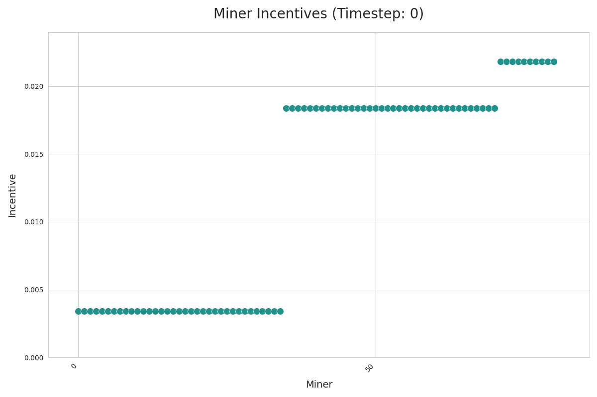

# Incentive Simulator

A tool for testing new reward functions by simulating their impact on miner incentive distributions.

This tool is currently geared towards simulating different reward functions on SN34. 

The goal is to generalize this repository to facilitate arbitrary validation mechanism simulations on historical data from any subnet.

Currently, `simulation.ipynb`...
- Loads and processes historical validator data from Weights & Biases (W&B) or local cache
- Parallelizes the cross product of validators x reward functions across available CPUs
- Computes and plots rewards, scores, weights and incentives at different timesteps
